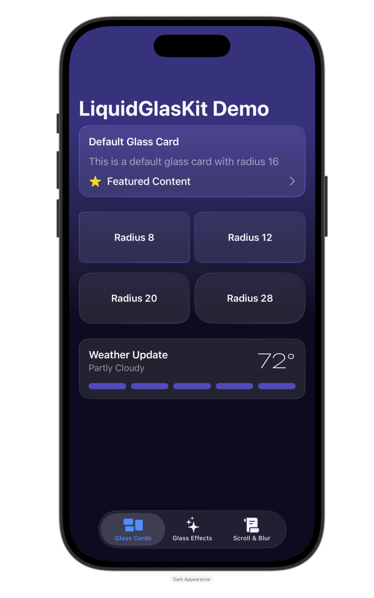

# LiquidGlasKit

A Swift package providing customizable modifiers for easy liquid glass effects and materials in SwiftUI.



## Features

- **Glass Card Effects**: Beautiful glass cards with adaptive transparency that respond to light/dark mode
- **Advanced Glass Effects**: Fine-grained control over glass appearance with tinting and corner radius options  
- **Cross-Platform Support**: Works on iOS 26.0+ with graceful fallbacks for older versions
- **SwiftUI Integration**: Drop-in modifiers that work seamlessly with your existing SwiftUI views

## Support

Love this project? Check out my books to explore more of AI and iOS development:
- [Exploring AI for iOS Development](https://academy.rudrank.com/product/ai)
- [Exploring AI-Assisted Coding for iOS Development](https://academy.rudrank.com/product/ai-assisted-coding)

Your support helps to keep this project growing!

## Requirements

- iOS 16.0+ (native glass effects available on iOS 26.0+)
- macOS 13.0+ (native glass effects available on macOS 26.0+)
- Swift 6.0+
- Xcode 16.0+ (native glass features with Xcode 26.0+)

## Installation

### Swift Package Manager

Add LiquidGlasKit to your project using Swift Package Manager:

```
dependencies: [
.package(url: "https://github.com/rryam/LiquidGlasKit.git", from: "0.2.0")
]
```

```swift
import SwiftUI
import LiquidGlasKit

struct ContentView: View {
    var body: some View {
        VStack {
            Text("Hello, World!")
                .padding()
                .glassCard()
        }
        .padding()
    }
}
```

Customize the corner radius:

```swift
Text("Custom Glass Card")
    .padding()
    .glassCard(radius: 24)
```

### Glass Effects

Apply advanced glass effects with full control over appearance:

```swift
Rectangle()
    .frame(width: 200, height: 100)
    .applyGlassEffect(.regularInteractive, cornerRadius: 12, tint: .blue)
```

Available glass effect types:

  - .clear - Minimal visual impact
  - .regular - Standard opacity and blur
  - .clearInteractive - Clear glass that responds to touch
  - .regularInteractive - Regular glass with touch response

### Navigation Bar Blur

Add a subtle blur effect to navigation areas:

```swift
ScrollView {
    // Your content here
}
.customNavBarBlur(.accent)
```

### Scroll Edge Effects

Control how your views behave at scroll boundaries:

```swift
ScrollView {
    LazyVStack {
        // Your scrollable content
    }
}
.applyScrollEdgeEffect(.soft)
```

Effect options:
  - .off - No scroll edge effect
  - .hard - Distinct visual feedback
  - .soft - Subtle visual feedback
  - .auto - Adapts to system preferences

###  Examples

Complete Glass Card Interface

```swift
struct GlassInterface: View {
    var body: some View {
        VStack(spacing: 20) {
            Text("Glass Interface")
                .font(.largeTitle)
                .bold()
            
            VStack {
                Text("This is a glass card")
                Text("It adapts to light and dark mode")
                    .foregroundStyle(.secondary)
            }
            .padding()
            .glassCard(radius: 16)
            
            Button("Interactive Glass Button") {
                // Action
            }
            .padding()
            .applyGlassEffect(.clearInteractive, cornerRadius: 8)
        }
        .padding()
    }
}
```

### Scrollable Content with Edge Effects

```swift
struct ScrollableGlassView: View {
    var body: some View {
        ScrollView {
            LazyVStack(spacing: 16) {
                ForEach(0..<50) { index in
                    Text("Item \(index)")
                        .padding()
                        .glassCard()
                }
            }
            .padding()
        }
        .applyScrollEdgeEffect(.soft)
        .customNavBarBlur(.primary)
    }
}
```

## License

This project is licensed under the MIT License - see the LICENSE file for details.
